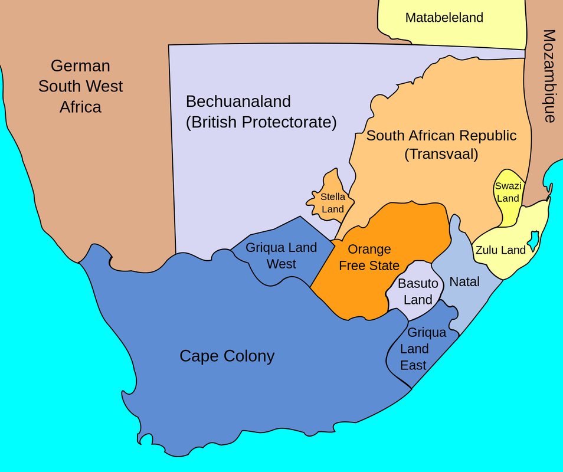

### _13 February 2023_

# Session 6

## Indenture in South Africa

The history of Gandhi in South Africa challenges
us to think about what it means to be diasporic,
and how Gandhi is diapsporic

### Abbreviated Orbit Discussion

Main points:

- Gandhi is viewed as a non-violent hero outside of
the Indian subcontinent but in reality he had other
issues regarding racism and imperialist tendencies
- Gandhi carried himself more as a British subject,
appealing to the British that the Indians should
have better freedoms than Africans because they had
\`\`better character" and were \`\`more civilized".
- Played into race making, including phrases like
Asiatic to distinguish from indigenous Africans

### South African Geography

States:

- Natal was largely Indian, formerly had many indentured
laborers
- Cape town had many Black Africans
- The Orange free state was largely White

{width=50%}

### Importance of Gandhi's Politics in South Africa

- Helps understand the power dynamic in South Africa
- Widens the focus of Gandhi's work from just India
to include his \`\`international" work

## Other Key Points about Gandhi

- Gandhi had a very empire-centric view of freedom-fighting
- He kept the contexts of race and class within the British
Empire
- He supported British war efforts
- Racial, class, and caste privilege in Gandhi's movement
led to strong Indian nationalism
- Elites were very aware of imperialism and saw that India
was the \`\`jewel" of the British empire
- The Indian national movement sees itself as more advanced
and at a higher level than Africans, similar to the race
system imposed by the Imperial system
- This was not the only racial system in India at the time,
other Indian activists were less racist, but Gandhi's
elitism eventually gained traction
- Similar to race-building: creating this race increased
a sense of nationalism and pride in independence

## Comparing South African and Indian Indenture

- South African indenture involved more explicit racial
partitioning
- Both involved post-slavery and indentured servitude
societies with few rights given to non-white people
- British pitted races against each other: coolies versus
former African slaves, or coolies versus native Africans
- In South Africa, the Zulu kingdom was a decent,
organized power, and they were not enslaved; the Indians
were the only workforce
- Very similar working conditions
- In South Africa, women had education and there were more
institutions and opportunities for Indians
- Additionally, in South Africa, there were passenger
Indians in an upper caste
- Indians in South Africa had closer connections to the
nation of India
- More intermarriage in the Caribbean, and more
segregation in South Africa

